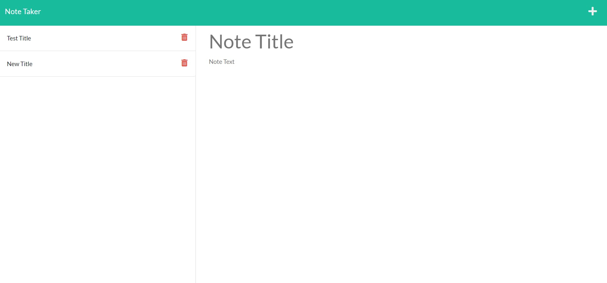

# easy-notetaker

https://sleepy-dawn-85394.herokuapp.com/

# <easy-notetaker>

https://github.com/julianr3/easy-notetaker

## Description

Great application for keeping track of notes and saving that information for future reference.

## Table of Contents

- [Installation](#installation)
- [Usage](#usage)
- [Credits](#credits)
- [License](#license)

## Installation
open vscode, open the terminal and npm install express. 

## Usage
open https://sleepy-dawn-85394.herokuapp.com/ and start taking notes. you are able to input a customized title as well as a enter any information needed. The information will be stored for easy future reference.

## Credits

Kyle Giuanta https://github.com/kgiunta

Isaak Morales https://github.com/CallMeIce

## License
Not Applicable

## Badges

